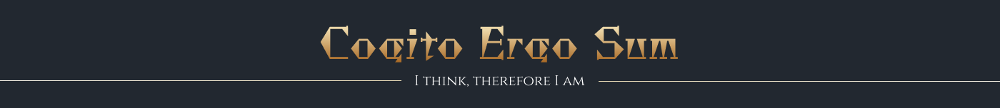
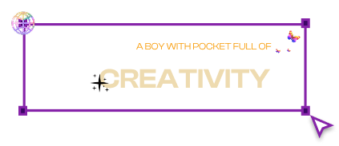

  

<h1 align="center">Hi 👋, I'm DHARMA TEJA </h1>
<h3 align="center">DESIGNER & DEVELOPER</h3>

  

  

  

 

- 🌱 I’m currently learning **AI, WEB2, WEB3**

- 👯 I’d love to collaborate for **HACKATHONS**

- 🤝 I’m looking for help with **Web3**

- 💬 Ask me about **Web development and Web3**

- 📫 How to reach me **dteja24682gmail.com**

- 📄 Know about my experiences [RESUME](https://drive.google.com/file/d/1VRd5ZVimJfhQCccWjNqkY2bNlVRqmAI3/view?usp=sharing)

- ⚡ When I'm not coding- [**I do video editing and storytelling for content**](https://www.instagram.com/teja.techh/)

<h3 align="left">Connect with me:</h3>

<h3 align="left">Languages and Tools:</h3>

                       

<h3 align="LET">SUPPORT:</h3>

<h3 align="LEFT">STATS:</h3>

 

